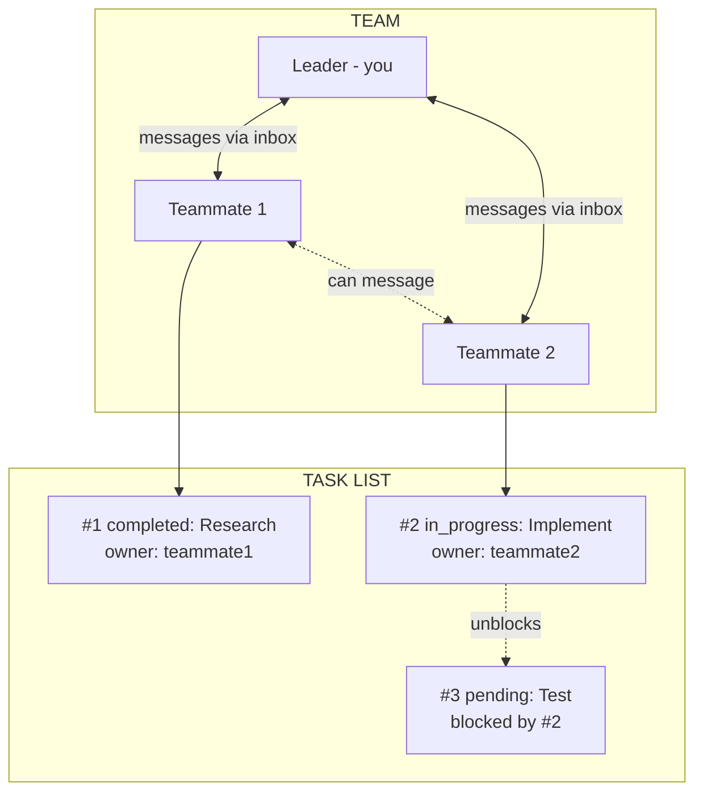
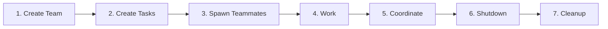
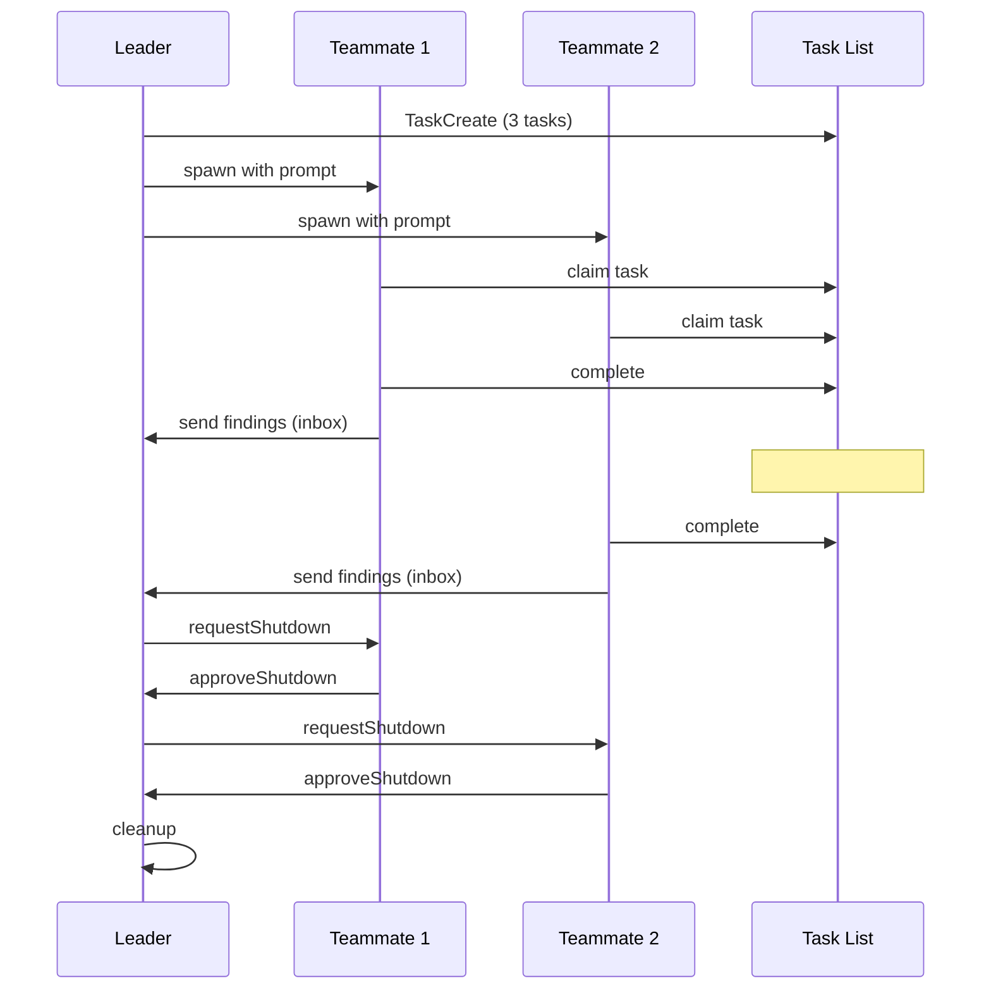

# Primitives

| Primitive | What It Is | File Location |
|-----------|-----------|---------------|
| **Agent** | A Claude instance that can use tools. The orchestrator is an agent; spawned instances are subagents. | N/A (process) |
| **Team** | A named group of agents working together. One leader, multiple teammates. | `~/.claude/teams/{name}/config.json` |
| **Teammate** | An agent that joined a team. Has a name, color, inbox. Spawned via Task with `team_name` + `name`. | Listed in team config |
| **Leader** | The agent that created the team. Receives teammate messages, approves plans/shutdowns. | First member in config |
| **Task** | A work item with subject, description, status, owner, and dependencies. | `~/.claude/tasks/{team}/N.json` |
| **Inbox** | JSON file where an agent receives messages from teammates. | `~/.claude/teams/{name}/inboxes/{agent}.json` |
| **Message** | A JSON object sent between agents. Can be text or structured (shutdown_request, idle_notification, etc). | Stored in inbox files |
| **Backend** | How teammates run. Auto-detected: `in-process` (same Node.js, invisible), `tmux` (separate panes, visible), `iterm2` (split panes in iTerm2). See `references/spawn-backends.md`. | Auto-detected based on environment |

## How They Connect

## Lifecycle

## Message Flow

