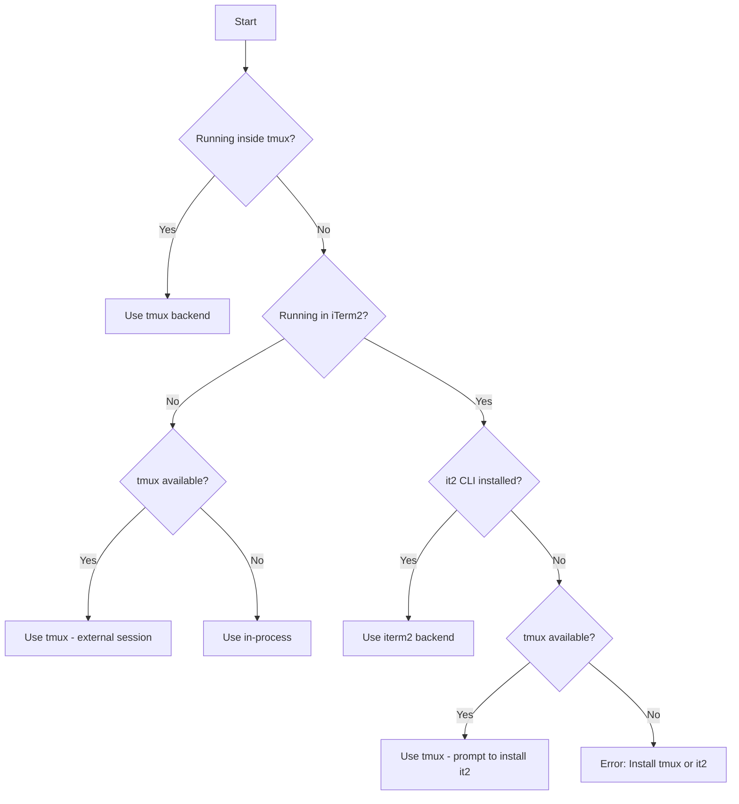

# Spawn Backends

Three spawn backends. Claude Code **auto-detects** the best one based on the environment.

## Backend Comparison

| Backend | How It Works | Visibility | Persistence | Speed |
|---------|-------------|------------|-------------|-------|
| **in-process** | Same Node.js process as leader | Hidden (background) | Dies with leader | Fastest |
| **tmux** | Separate terminal in tmux session | Visible in tmux | Survives leader exit | Medium |
| **iterm2** | Split panes in iTerm2 window | Visible side-by-side | Dies with window | Medium |

## Auto-Detection Logic

Backend selection decision tree:



**Detection checks:**
1. `$TMUX` environment variable -> inside tmux
2. `$TERM_PROGRAM === "iTerm.app"` or `$ITERM_SESSION_ID` -> in iTerm2
3. `which tmux` -> tmux available
4. `which it2` -> it2 CLI installed

## in-process (Default for non-tmux)

Async tasks within the same Node.js process. No new process spawned; communication via in-memory queues.

**Selected when:**
- Not running inside tmux session
- Non-interactive mode (CI, scripts)
- Explicitly set via `CLAUDE_CODE_SPAWN_BACKEND=in-process`

**Characteristics:**
```
+-----------------------------------------+
|           Node.js Process               |
|  +---------+  +---------+  +---------+ |
|  | Leader  |  |Worker 1 |  |Worker 2 | |
|  | (main)  |  | (async) |  | (async) | |
|  +---------+  +---------+  +---------+ |
+-----------------------------------------+
```

**Pros:**
- Fastest startup (no process spawn)
- Lowest overhead
- Works everywhere

**Cons:**
- Can't see teammate output in real-time
- All die if leader dies
- Harder to debug

```javascript
// in-process is automatic when not in tmux
Task({
  team_name: "my-project",
  name: "worker",
  subagent_type: "general-purpose",
  prompt: "...",
  run_in_background: true
})

// Force in-process explicitly
// export CLAUDE_CODE_SPAWN_BACKEND=in-process
```

## tmux

Separate Claude instances in tmux panes/windows. Each teammate gets its own pane and process; communication via inbox files.

**Selected when:**
- Running inside a tmux session (`$TMUX` is set)
- tmux available and not in iTerm2
- Explicitly set via `CLAUDE_CODE_SPAWN_BACKEND=tmux`

**Layout modes:**

1. **Inside tmux (native):** Splits the current window
```
+-----------------+-----------------+
|                 |    Worker 1     |
|     Leader      +-----------------+
|   (your pane)   |    Worker 2     |
|                 +-----------------+
|                 |    Worker 3     |
+-----------------+-----------------+
```

2. **Outside tmux (external session):** Creates a new tmux session called `claude-swarm`
```bash
# Your terminal stays as-is
# Workers run in separate tmux session

# View workers:
tmux attach -t claude-swarm
```

**Pros:**
- See teammate output in real-time
- Teammates survive leader exit
- Can attach/detach sessions
- Works in CI/headless environments

**Cons:**
- Slower startup (process spawn)
- Requires tmux installed
- More resource usage

```bash
# Start tmux session first
tmux new-session -s claude

# Or force tmux backend
export CLAUDE_CODE_SPAWN_BACKEND=tmux
```

**Useful tmux commands:**
```bash
# List all panes in current window
tmux list-panes

# Switch to pane by number
tmux select-pane -t 1

# Kill a specific pane
tmux kill-pane -t %5

# View swarm session (if external)
tmux attach -t claude-swarm

# Rebalance pane layout
tmux select-layout tiled
```

## iterm2 (macOS only)

Split panes within the iTerm2 window via `it2` CLI. Each teammate visible side-by-side; communication via inbox files.

**Selected when:**
- Running in iTerm2 (`$TERM_PROGRAM === "iTerm.app"`)
- `it2` CLI is installed and working
- Python API enabled in iTerm2 preferences

**Layout:**
```
+-----------------+-----------------+
|                 |    Worker 1     |
|     Leader      +-----------------+
|   (your pane)   |    Worker 2     |
|                 +-----------------+
|                 |    Worker 3     |
+-----------------+-----------------+
```

**Pros:**
- Visual debugging - see all teammates
- Native macOS experience
- No tmux needed
- Automatic pane management

**Cons:**
- macOS + iTerm2 only
- Requires setup (it2 CLI + Python API)
- Panes die with window

**Setup:**
```bash
# 1. Install it2 CLI
uv tool install it2
# OR
pipx install it2
# OR
pip install --user it2

# 2. Enable Python API in iTerm2
# iTerm2 -> Settings -> General -> Magic -> Enable Python API

# 3. Restart iTerm2

# 4. Verify
it2 --version
it2 session list
```

**If setup fails:**
Claude Code prompts to set up it2 on first teammate spawn. Options:
1. Install it2 now (guided setup)
2. Use tmux instead
3. Cancel

## Forcing a Backend

```bash
# Force in-process (fastest, no visibility)
export CLAUDE_CODE_SPAWN_BACKEND=in-process

# Force tmux (visible panes, persistent)
export CLAUDE_CODE_SPAWN_BACKEND=tmux

# Auto-detect (default)
unset CLAUDE_CODE_SPAWN_BACKEND
```

## Backend in Team Config

Backend type recorded per-teammate in `config.json`:

```json
{
  "members": [
    {
      "name": "worker-1",
      "backendType": "in-process",
      "tmuxPaneId": "in-process"
    },
    {
      "name": "worker-2",
      "backendType": "tmux",
      "tmuxPaneId": "%5"
    }
  ]
}
```

## Troubleshooting Backends

| Issue | Cause | Solution |
|-------|-------|----------|
| "No pane backend available" | Neither tmux nor iTerm2 available | Install tmux: `brew install tmux` |
| "it2 CLI not installed" | In iTerm2 but missing it2 | Run `uv tool install it2` |
| "Python API not enabled" | it2 can't communicate with iTerm2 | Enable in iTerm2 Settings -> General -> Magic |
| Workers not visible | Using in-process backend | Start inside tmux or iTerm2 |
| Workers dying unexpectedly | Outside tmux, leader exited | Use tmux for persistence |

## Checking Current Backend

```bash
# See what backend was detected
cat ~/.claude/teams/{team}/config.json | jq '.members[].backendType'

# Check if inside tmux
echo $TMUX

# Check if in iTerm2
echo $TERM_PROGRAM

# Check tmux availability
which tmux

# Check it2 availability
which it2
```
